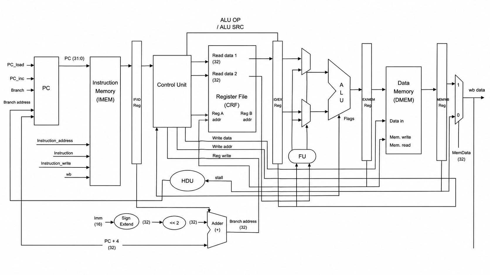

# ARM Compatible 5 stage pipelined CPU

## Overview
This repository contains the design and implementation of a **5-stage pipelined CPU** for the ARM ISA. The design implements classic pipelining with hazard detection, data forwarding, and branch resolution.

The processor is written in Verilog and targets Xilinx FPGAs. It has been tested on the NetFPGA v2.

## Instruction Encoding


<!-- TODO: add ISA/instruction encoding diagram image -->

All instructions are 32 bits wide with a common field layout:

| Bits    | 31:28 | 27:26 | 25  | 24:21    | 20  | 19:16 | 15:12 | 11:0                |
|---------|-------|-------|-----|----------|-----|-------|-------|---------------------|
| Field   | Cond  | Type  | Imm | Opcode   | Set | Rn    | Rd    | Operand / Rs / Offset |

- **Cond** — 4-bit condition field, evaluated against the NZCV flags to decide whether the instruction executes
- **Type** — top-level instruction class (`00` = data processing, `01` = load/store, `10` = branch)
- **Imm** — selects between register operand (`Rs`, bits [3:0]) and immediate operand (bits [11:0]) for data-processing instructions
- **Opcode** — selects the specific ALU/data-processing operation
- **Set** — when asserted, the instruction updates the NZCV flags
- **Rn** — first source register
- **Rd** — destination register (data processing) or source/destination register (load/store)
- **Operand / Address offset** — immediate value, shifted register, or memory addressing offset depending on instruction class

### Data Processing (Type = `00`)

| Mnemonic | Opcode [24:21] | Operation                  |
|----------|----------------|-----------------------------|
| AND      | `0000`         | Rd = Rn & Operand            |
| XOR      | `0001`         | Rd = Rn ^ Operand            |
| SUB      | `0010`         | Rd = Rn − Operand            |
| RSUB     | `0011`         | Rd = Operand − Rn (reverse subtract) |
| ADD      | `0100`         | Rd = Rn + Operand            |
| ADC      | `0101`         | Rd = Rn + Operand + Carry    |
| SUBC     | `0110`         | Rd = Rn − Operand − !Carry   |
| RSUBC    | `0111`         | Rd = Operand − Rn − !Carry   |
| TST      | `1000`         | Rn & Operand (flags only, no writeback) |
| TEQ      | `1001`         | Rn ^ Operand (flags only, no writeback) |
| CMP      | `1010`         | Rn − Operand (flags only, no writeback) |
| CMN      | `1011`         | Rn + Operand (flags only, no writeback) |
| OR       | `1100`         | Rd = Rn \| Operand           |
| LSL/MOV  | `1101`         | Rd = Operand (optionally shifted) |
| BIC      | `1110`         | Rd = Rn & ~Operand (bit clear) |
| INV      | `1111`         | Rd = ~Operand (bitwise NOT)  |

All data-processing instructions update the NZCV flags when **Set** (bit 20) is asserted. `TST`, `TEQ`, `CMP`, and `CMN` always compute their result for flag-setting purposes only and never write back to `Rd`.

### Load/Store (Type = `01`)

| Mnemonic | Bit 24 (Imm) | Bits [23:20] (P, U, B, W) | Operation |
|----------|--------------|----------------------------|-----------|
| LW       | `0`          | P, U, B, W, **L=1**        | Rd = Mem[Rn + Address offset] |
| SW       | `0`          | P, U, B, W, **L=0**        | Mem[Rn + Address offset] = Rd |

- **P** — pre/post-indexed addressing select
- **U** — up/down (add/subtract offset)
- **B** — byte/word access size
- **W** — writeback of the computed address into `Rn`
- **L** — load (1) vs. store (0), distinguishing `LW` from `SW`

### Branch (Type = `10`)

| Field          | Bits     | Description |
|----------------|----------|--------------|
| L              | `25`     | Link bit — when set, stores the return address (branch-and-link) |
| Signed Immediate | `[23:0]` | 24-bit signed offset, sign-extended and shifted for word alignment, added to the PC |

Branches are conditionally executed based on the 4-bit **Cond** field evaluated against the current NZCV flags (e.g. `EQ`, `NE`, `GT`, `LT`, always/never, etc.), matching the condition-code scheme of classic ARM branch instructions.

## Pipeline Stages

The processor is organized into five stages:

```
IF  →  ID  →  EX  →  MEM  →  WB
```

| Stage | Name              | Function                                                                 |
|-------|-------------------|---------------------------------------------------------------------------|
| IF    | Instruction Fetch | Fetch instruction from instruction memory using PC                       |
| ID    | Decode            | Decode instruction, read register file, generate control signals         |
| EX    | Execute           | ALU operations, branch target/condition resolution, NZCV flag generation |
| MEM   | Memory            | Data memory access (loads/stores) via block RAM                          |
| WB    | Writeback         | Write result back to register file                                       |

## Datapath Architecture


<!-- TODO: add datapath diagram image -->

The full datapath is organized around four pipeline register boundaries — **IF/ID**, **ID/EX**, **EX/MEM**, and **MEM/WB** — each latching control and data signals between adjacent stages.

**IF stage:** The `PC` block is controlled by `PC_stall`, `PC_enable`, `Branch`, and `Branch_address` inputs and outputs the current `PC (31:0)`. This value is supplied to **Instruction Memory (IMEM)**, where `PC[10:2]` is used as the instruction address. IMEM also includes `Instruction_address`, `Instruction`, `Instruction_write`, and `wb` ports for external instruction loading. The fetched instruction and corresponding `PC` value are then latched into the **IF/ID** register.

**ID stage:** The instruction from the **IF/ID** register is decoded by the `Control Unit`, which generates the required control signals. Simultaneously, the instruction's register fields are supplied to the `Register File (RF)`, which reads two operands, `Read data 0 (64)` and `Read data 1 (64)`, addressed by `Reg 0 addr` and `Reg 1 addr`. The immediate field is sign-extended (`Sign Extend`, 32-bit result), shifted left by 2 (`<<2`) for word alignment, and added to `PC (32)` using the `Adder (+)` to generate the `Branch address (32)` (`PC` is used instead of `PC+4` due to IMEM BRAM latency). The ALU `NZCV` flags are compared against the instruction's condition field to determine whether a branch should be taken. The register operands and control signals are then latched into the **ID/EX** register. Early branching is implemented by returning the `Branch address` and `Branch taken` signals to the `PC` block.

**EX stage:** The operands from the **ID/EX** register pass through forwarding multiplexers, which select between the register file outputs and forwarded values provided by the `Forwarding Unit (FU)` to resolve RAW hazards. The `ALU SRC` control signal selects either the forwarded register operand or the sign-extended immediate for immediate operations and address calculations. The `ALU` performs the operation specified by `ALU OP`, producing the result and updating the `NZCV` flags. The `FU` monitors the **EX/MEM** and **MEM/WB** pipeline registers to supply forwarded data when required, avoiding unnecessary stalls. The ALU result and associated control signals are then latched into the **EX/MEM** register, while the updated `NZCV` flags are forwarded to the **ID** stage for branch condition evaluation.

**MEM stage:** The ALU result from the **EX/MEM** register is used as the address for the `Data Memory (DMEM)`. During a `sw` operation, `Read data 0 (64)` is written to memory, while during a `lw` operation, data is read from memory. These memory accesses are controlled by the `MemWrite` signal. The memory read data, ALU result, and associated control signals are then latched into the **MEM/WB** register.

**WB stage:** The outputs of the **MEM/WB** register are supplied to a final 2:1 multiplexer, which selects between the ALU result (`0`) and the memory read data (`MemData (32)`, `1`) under control of the `Mem2Reg` signal. The selected value becomes `wb data`, which is written back to the `Register File (RF)`. The `WReg_WE` and `WReg_address` control signals are also returned to the register file in the **ID** stage to complete the write-back operation.

**Hazard Detection Unit:** The `Hazard Detection Unit (HDU)` monitors pipeline dependencies to detect hazards that cannot be resolved through forwarding, such as load-use hazards. When a hazard is detected, it stalls the `PC` and **IF/ID** registers and inserts a bubble into the pipeline by preventing control signals from advancing, ensuring perfect execution order.

**Forwarding Unit:** The `Forwarding Unit (FU)` detects read-after-write (RAW) data hazards by comparing the source registers in the **ID/EX** register with the destination registers in the **EX/MEM** and **MEM/WB** registers. When a dependency is found, it controls the forwarding multiplexers to route the most recent result directly to the ALU inputs, eliminating unnecessary pipeline stalls.


## Features

- **5-stage in-order pipeline** with full datapath (IF/ID/EX/MEM/WB)
- **Hazard Detection Unit (HDU)** for load-use hazards, correctly accounting for block RAM read latency
- **Forwarding unit (FU)** to resolve EX/MEM and MEM/WB data hazards without unnecessary stalling
- **ARM-style conditional branching**, with NZCV condition flag evaluation and a 24-bit signed branch immediate, sign-extended and shifted for word alignment
- **Branch flush logic** that flushes IF and ID stage instructions in the same cycle as a taken branch
- **Per-pipeline NZCV flag register**, updated only by instructions that set flags
- **Aligned writeback path**, with load data correctly registered and aligned with the writeback mux


